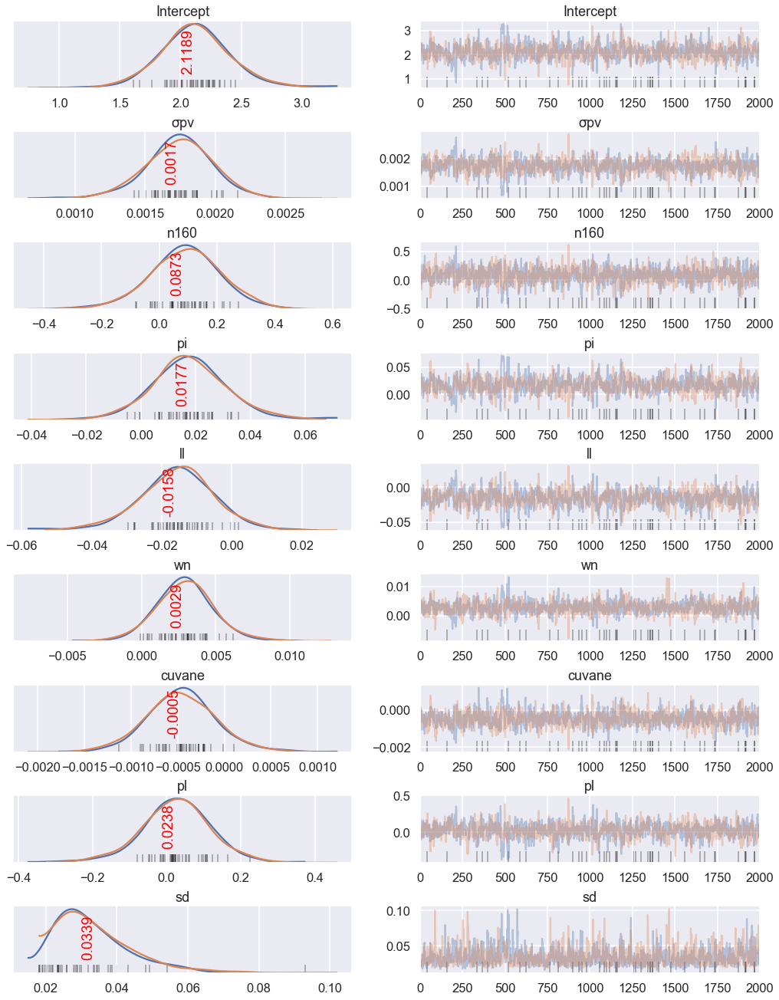
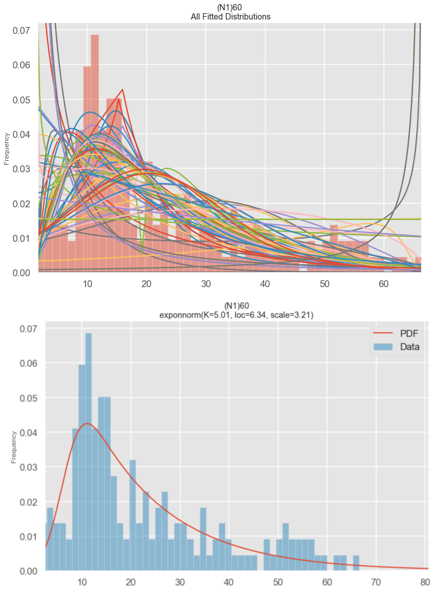

## bayesian_analysis_geotech

Bayesian Analysis for geotechnical parameters

Modern engineering problems are facing the growing demand to deals with huge amount of data and their intrinsic uncertainties. This exigence has led us to unprece-dented insights and developments in the machine learning field. To date, the healthcare and financial sectors has been the precursor of practical application of machine learning approaches. In geotechnics and rock mechanics, the materials we deal with are characterized by a large amount of data, various levels of uncertainty and often a prior knowledge, therefore they lend themselves well to this type of analy-sis. This article aims to present Bayesian methods and machine learning algorithms applied for geotechnical characterization of soil and rocks. Once the test sample has been properly filtered and classified, we will demonstrate the potentiality of multivari-ate Bayesian linear regression as a main tool for dealing with multivariate data and uncertainty. In addition to frequentist approaches, where the response is assumed to be sampled from a distribution, in Bayesian models also the regression parameters are similarly based on a prior distribution. In the second part of the article a practical case of geotechnical supervised, regression machine learning problem will be presented and solved by means of Python scripts. The main purpose of this article is not to briefly rewrite the principles of machine learning, as the bibliography in this field is broad and complete, but rather to spread its potential in the practice and entice the geotechnical reader to use them.

